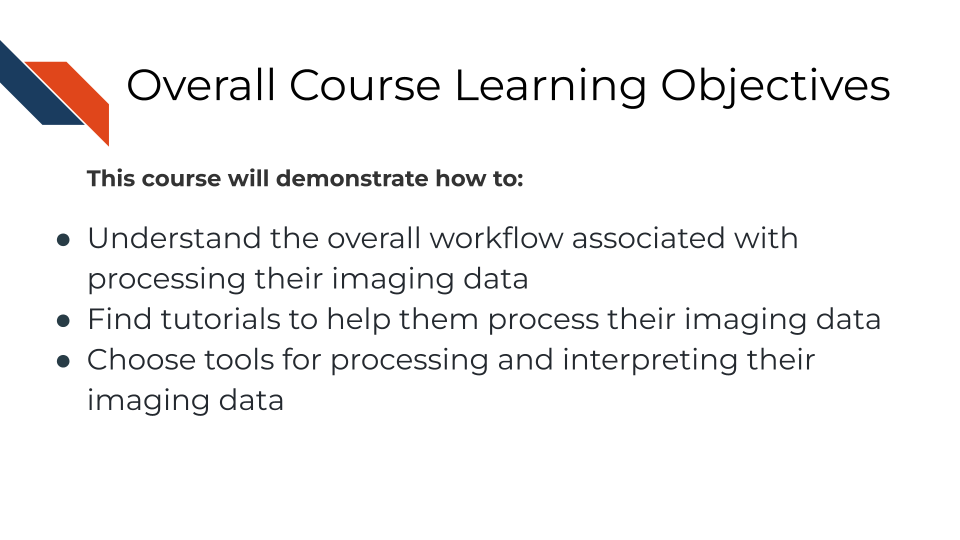

# Machine Learning for Pathology

## Basics of Machine Learning

### Learning Objectives

## Tumor Heterogeneity/Diversity

### Learning Objectives

## Tissue/cell Segmentation

### Learning Objectives

## Quantification Methods

### Learning Objectives

